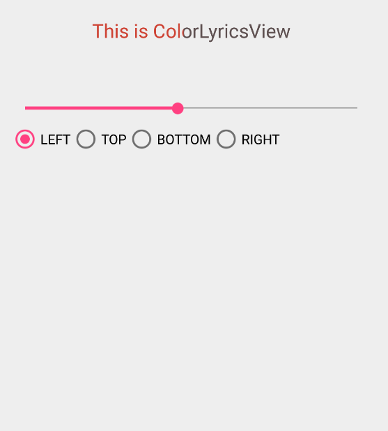

# ColorLyricsView
ColorLyricsView
##Demo
 
 

 
 

 
 
##XML
```xml
    <com.chaek.android.ColorLyricsView
        android:id="@+id/a"
        android:layout_width="match_parent"
        android:layout_height="30dp"
        app:progressColor="#54f5f0"
        app:txtColor="#5e5050"
        app:txtSize="20sp"
        app:maxProgress="100"
        app:progress="20"
        app:type="TOP"
        />
```

##Gradle
```java
dependencies{
    compile 'com.chaek.android:colorlyricsview:1.0.0'
}
```

##Attributes

name     | format | description |java code
--- | ---   |---           |---
txtSize | dimension\|integer | text view size (sp)| public void setTextSize(int textSize) 
txtColor    | color\|reference   | text view default color|  public void setTextColor(int color) 
progressColor     | color\|reference    | progress color| public void setProgressColor(int progressColor)
maxProgress     | integer    | max Progress |none
progress     | integer    | progress|public void setProgress(int mProgress) 
type     | enum    | TOP or LEFT or RIGHT or BOTTOM| public void setDirectionType(int direction)

